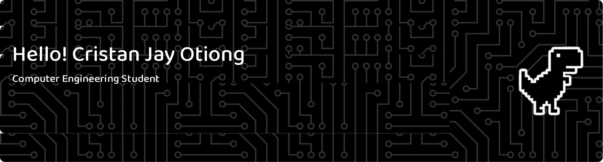

## Tech Stack

 
## About Me

**Computer Engineering student passionate about technology, programming, and building useful digital projects.**

## GitHub Stats
 

## Play With Me

###

<picture data-importer="pacman">
  <source media="(prefers-color-scheme: dark)" srcset="https://raw.githubusercontent.com/cjotiong5-ui/cjotiong5-ui/pacman-output/pacman-contribution-graph-dark.svg?game=pacman">
  <source media="(prefers-color-scheme: light)" srcset="https://raw.githubusercontent.com/cjotiong5-ui/cjotiong5-ui/pacman-output/pacman-contribution-graph.svg?game=pacman">
  
</picture>

<h2 align="center">👾 Pac-Man Contribution Graph</h2>

  

###

###

<h2 align="center">🐍 Contribution Snake</h2>

  

